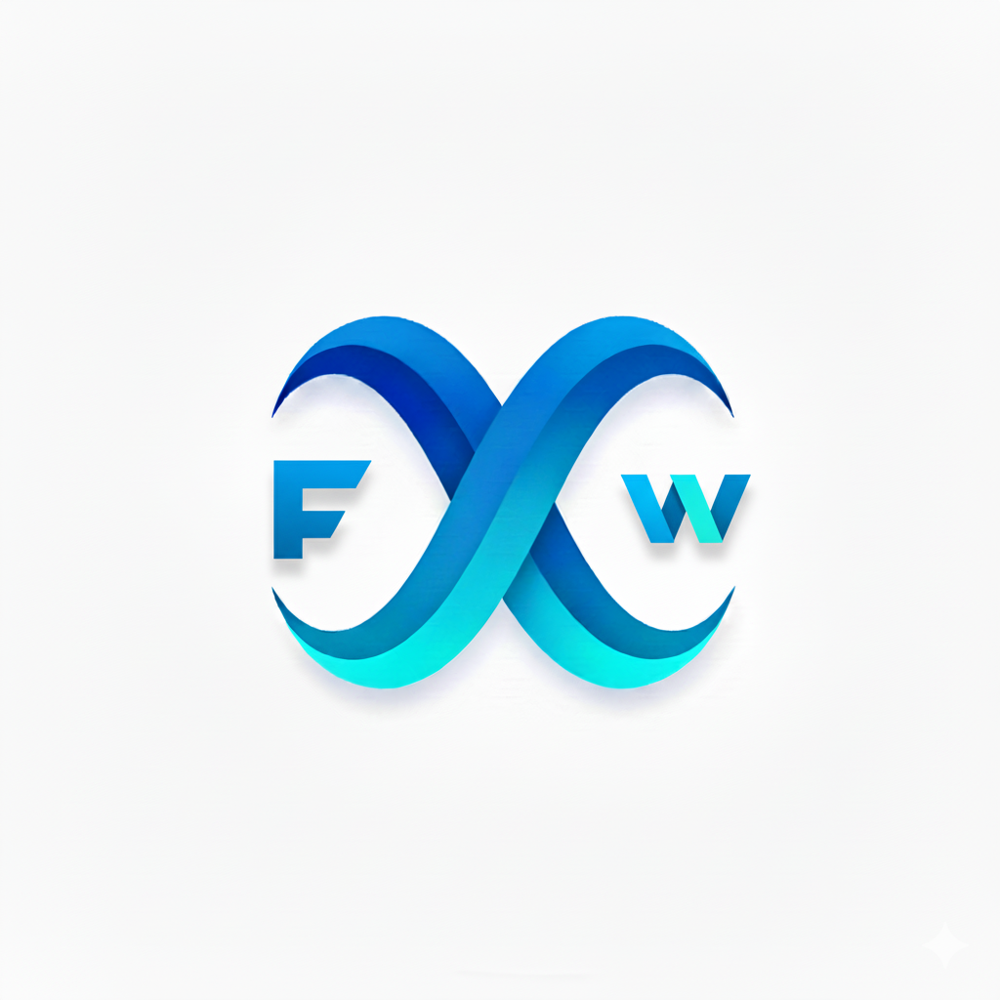
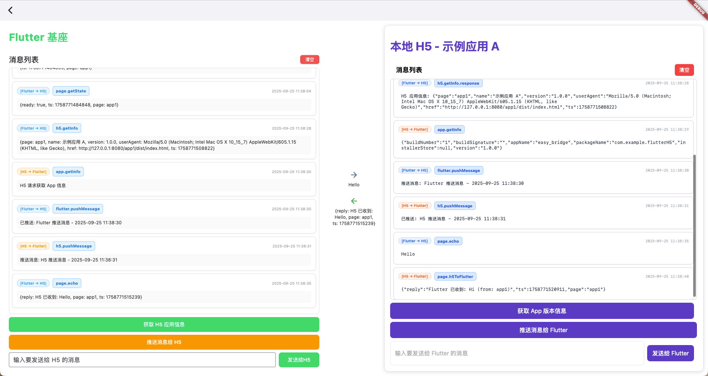

# Easy Bridge

<div align="center">
  
</div>

<div align="center">
  <a href="README.md">🇨🇳 中文</a> | 
  <a href="README_EN.md">🇺🇸 English</a>
</div>

## 🖥️ 平台支持

| 平台    | 状态    |
| ------- | ------- |
| Windows | ✅ 支持 |
| macOS   | ✅ 支持 |
| Android | ✅ 支持 |

一个基于 Flutter + WebView + 本地 HTTP 服务器的混合开发解决方案，支持 Flutter 基座与 H5 应用之间的双向通信，同时支持本地 H5 应用和在线 URL 加载。

## 📋 项目概述

该框架提供了一套完整的 Flutter 与 H5 应用交互机制，包括：

- 🔄 **双向通信**: Flutter ↔ H5 方法调用和事件传递
- 🌐 **多源支持**: 本地 H5 应用 + 在线 URL 加载
- 🔌 **桥接系统**: 基于 AppBridge 的通信桥梁
- 🐛 **调试界面**: 实时消息展示和交互测试
- 🛡️ **类型安全**: 完整的错误处理和超时机制
- 🔒 **安全防护**: 重定向循环检测和错误恢复

## 📱 项目截图

<div align="center">
  
  <p><em>应用主界面展示 - Flutter 基座与 H5 应用的双向通信调试界面</em></p>
</div>

<div align="center">
  
  <p><em>应用演示 - Flutter 与 H5 双向通信实时交互</em></p>
</div>

## 🏗️ 项目结构

```
easy_bridge/
├── lib/
│   ├── main.dart                      # 应用入口
│   ├── app_center.dart                # 应用中心页面
│   ├── h5_webview.dart                # 统一的 H5 WebView 组件
│   ├── app1_h5_webview_debug_page.dart # App1 调试页面
│   └── utils/
│       ├── app_bridge.dart            # 核心桥接器
│       └── localhost_server_manager.dart # 本地服务器管理
├── assets/h5/                         # H5 应用资源
│   ├── app1/                          # 示例应用 A
│   │   └── dist/                      # 构建输出目录
│   │       ├── index.html             # 主页面
│   │       ├── app.js                 # JavaScript 逻辑
│   │       └── style.css              # 样式文件
│   └── app2/                          # 示例应用 B
│       └── dist/
│           ├── index.html
│           ├── app.js
│           └── style.css
└── README.md                          # 本文档
```

## 🚀 快速开始

### 1. 基本用法

#### 本地 H5 应用

```dart
import 'package:flutter/material.dart';
import 'h5_webview.dart';
import 'utils/app_bridge.dart';

class MyApp extends StatelessWidget {
  @override
  Widget build(BuildContext context) {
    return MaterialApp(
      home: Scaffold(
        appBar: AppBar(title: Text('本地 H5 应用')),
        body: H5Webview(
          appName: 'app1',  // 对应 assets/h5/app1/dist/index.html
          bridge: AppBridge.instance,
          onLoadStop: (url) {
            print('页面加载完成: $url');
          },
        ),
      ),
    );
  }
}
```

#### 在线 URL 加载

```dart
H5Webview(
  appName: 'online_demo',     // 用作标识符
  onlineUrl: 'https://flutter.dev',  // 在线 URL
  bridge: AppBridge.instance,
  onLoadStop: (url) {
    print('在线页面加载完成: $url');
  },
)
```

### 2. 应用中心使用

运行应用后，您将看到应用中心页面，提供了三个示例：

- **示例应用 A (本地)**: 带完整调试界面的本地 H5 应用
- **示例应用 B (本地)**: 简单的本地 H5 应用
- **在线应用示例**: 加载在线 URL 的示例

### 3. 创建新的 H5 应用

在 `assets/h5/` 下创建新目录，如 `myapp/`：

```
assets/h5/myapp/
└── dist/              # 构建输出目录
    ├── index.html     # 必需：主页面（固定入口文件）
    ├── app.js         # 建议：JavaScript 逻辑
    └── style.css      # 可选：样式文件
```

## 🔧 核心组件

### H5Webview

统一的 WebView 组件，支持本地 H5 应用和在线 URL 加载。

**参数说明：**

| 参数               | 类型                             | 默认值 | 说明                                                                        |
| ------------------ | -------------------------------- | ------ | --------------------------------------------------------------------------- |
| `appName`          | `String`                         | 必需   | H5 应用标识符。本地模式对应 `assets/h5/<appName>/dist/`；在线模式作为标识符 |
| `onlineUrl`        | `String?`                        | `null` | 在线 URL。如果提供，将忽略 `appName` 对应的本地资源                         |
| `bridge`           | `AppBridge`                      | 必需   | 桥接器实例，用于 Flutter 与 H5 通信                                         |
| `onWebViewCreated` | `WebViewCreatedCallback?`        | `null` | WebView 创建回调                                                            |
| `onLoadStop`       | `Function(String)?`              | `null` | 页面加载完成回调                                                            |
| `onLoadError`      | `Function(String, int, String)?` | `null` | 页面加载错误回调                                                            |
| `onProgress`       | `Function(int)?`                 | `null` | 加载进度回调                                                                |

### AppBridge

核心桥接器，负责 Flutter 与 H5 之间的通信。

**特性：**

- 双向方法调用（Request/Response）
- 双向事件传递（Fire-and-Forget）
- 自动错误处理和超时机制
- 类型安全的参数传递

### LocalhostServerManager

本地 HTTP 服务器管理器，自动处理端口分配和资源服务。

**特性：**

- 自动端口分配和冲突处理
- 支持多种静态资源类型
- 开发模式下的调试日志
- 单例模式，避免重复启动

## 🐛 调试功能

### App1H5WebviewDebugPage

专门的调试页面，提供完整的双向通信测试界面：

**界面布局：**

- **左侧：Flutter 基座**

  - 统一消息列表（支持自动/手动滚动）
  - 清空消息按钮
  - "获取 H5 应用信息" 按钮
  - "推送消息给 H5" 按钮
  - 自定义消息输入框

- **中间：交互指示器**

  - 蓝色右箭头：Flutter → H5 的消息
  - 绿色左箭头：H5 → Flutter 的消息
  - 实时显示当前传输的消息内容

- **右侧：H5 应用**
  - 完整的 H5 应用界面
  - 与 Flutter 的实时交互

**调试特性：**

- 消息自动追踪和记录
- 错误高亮显示
- 时间戳和方向标识
- 智能滚动（接近底部时自动滚动）

## 📡 通信协议

### 1. 方法调用 (Request/Response)

#### Flutter → H5

**Flutter 端发起调用：**

```dart
// 基本调用
final result = await AppBridge.instance.invokeJs('h5.methodName', parameters);

// 示例：获取 H5 应用信息
final info = await AppBridge.instance.invokeJs('h5.getInfo');

// 示例：发送消息到 H5
final reply = await AppBridge.instance.invokeJs('page.echo', {'message': 'Hello H5'});
```

**H5 端注册方法：**

```javascript
// 注册方法供 Flutter 调用
window.AppBridge.register("h5.getInfo", async function () {
  return {
    page: "app1",
    name: document.title,
    version: "1.0.0",
    userAgent: navigator.userAgent,
    href: location.href,
    ts: Date.now(),
  };
});

window.AppBridge.register("page.echo", async function (params) {
  const message = params.message;
  return {
    reply: "H5 已收到: " + message,
    page: "app1",
    ts: Date.now(),
  };
});
```

#### H5 → Flutter

**H5 端发起调用：**

```javascript
// 基本调用
const result = await window.AppBridge.invoke("flutter.methodName", parameters);

// 示例：获取 Flutter 应用信息
const appInfo = await window.AppBridge.invoke("app.getInfo");

// 示例：发送消息到 Flutter
const reply = await window.AppBridge.invoke("page.h5ToFlutter", {
  message: "Hello Flutter",
  from: "app1",
});
```

**Flutter 端注册方法：**

```dart
// 注册方法供 H5 调用
AppBridge.instance.register('app.getInfo', (params) async {
  final info = await PackageInfo.fromPlatform();
  return {
    'appName': info.appName,
    'packageName': info.packageName,
    'version': info.version,
    'buildNumber': info.buildNumber,
    'buildSignature': info.buildSignature,
    'installerStore': info.installerStore,
  };
});

AppBridge.instance.register('page.h5ToFlutter', (params) async {
  String message;
  String? from;
  if (params is Map) {
    message = params['message']?.toString() ?? 'No message';
    from = params['from']?.toString();
  } else {
    message = params?.toString() ?? 'null';
  }

  final fullMessage = from != null ? '$message (from: $from)' : message;
  return {
    'reply': 'Flutter 已收到: $fullMessage',
    'page': 'app1',
    'ts': DateTime.now().millisecondsSinceEpoch,
  };
});
```

### 2. 事件系统 (Fire-and-Forget)

#### Flutter → H5

**Flutter 发送事件：**

```dart
// 发送事件到 H5（无需等待返回）
await AppBridge.instance.emitEventToJs('flutter.pushMessage', {
  'message': 'Flutter 推送消息',
  'from': 'flutter',
  'timestamp': DateTime.now().millisecondsSinceEpoch,
});
```

**H5 监听事件：**

```javascript
// 监听 Flutter 发送的事件
window.AppBridge.on("flutter.pushMessage", function (payload) {
  console.log("收到 Flutter 推送:", payload.message);
  // 更新 UI 显示推送消息
  document.getElementById(
    "flutter-messages"
  ).innerHTML += `<div>Flutter: ${payload.message}</div>`;
});
```

#### H5 → Flutter

**H5 发送事件：**

```javascript
// 发送事件到 Flutter（无需等待返回）
window.AppBridge.emit("page.ready", {
  ts: Date.now(),
  page: "app1",
});

window.AppBridge.emit("h5.pushMessage", {
  message: "H5 推送消息",
  from: "h5",
  timestamp: Date.now(),
});
```

**Flutter 监听事件：**

```dart
// 监听 H5 发送的事件
AppBridge.instance.onEvent('page.ready', (payload) {
  print('H5 页面准备完成: $payload');
});

AppBridge.instance.onEvent('h5.pushMessage', (payload) {
  final message = payload is Map && payload['message'] != null
      ? payload['message'].toString()
      : payload.toString();
  print('收到 H5 推送消息: $message');
});
```

## 📚 标准 API 清单

### Flutter 端提供的方法

| 方法名             | 参数                               | 返回值                                                                         | 说明                  |
| ------------------ | ---------------------------------- | ------------------------------------------------------------------------------ | --------------------- |
| `page.h5ToFlutter` | `{message: string, from?: string}` | `{reply: string, page: string, ts: number}`                                    | 接收 H5 消息并回复    |
| `app.getInfo`      | -                                  | `{appName, packageName, version, buildNumber, buildSignature, installerStore}` | 获取 Flutter 应用信息 |

### H5 端提供的方法

| 方法名          | 参数                | 返回值                                       | 说明             |
| --------------- | ------------------- | -------------------------------------------- | ---------------- |
| `page.getState` | -                   | `{ready: boolean, ts: number, page: string}` | 获取页面状态     |
| `page.echo`     | `{message: string}` | `{reply: string, page: string, ts: number}`  | 回音测试         |
| `h5.getInfo`    | -                   | `{page, name, version, userAgent, href, ts}` | 获取 H5 应用信息 |

### 标准事件

#### Flutter → H5 事件

| 事件名                | 数据格式                                             | 说明             |
| --------------------- | ---------------------------------------------------- | ---------------- |
| `flutter.pushMessage` | `{message: string, from: string, timestamp: number}` | Flutter 推送消息 |

#### H5 → Flutter 事件

| 事件名           | 数据格式                                               | 说明         |
| ---------------- | ------------------------------------------------------ | ------------ |
| `page.ready`     | `{ts: number, page: string}`                           | 页面加载完成 |
| `h5.pushMessage` | `{message: string, from?: string, timestamp?: number}` | H5 推送消息  |

## 🔒 安全与错误处理

### 重定向循环防护

针对在线 URL 可能出现的重定向问题，框架提供了多层防护：

```dart
// 重定向计数检测
if (_lastUrl == url?.toString()) {
  _redirectCount++;
  if (_redirectCount > 5) {
    print('[H5Webview] Redirect loop detected, stopping load');
    _controller?.stopLoading();
    return;
  }
}

// HTTP/HTTPS 循环检测
shouldOverrideUrlLoading: (controller, navigationAction) async {
  // 防止 HTTP 到 HTTPS 的循环重定向
  if (循环条件) {
    return NavigationActionPolicy.CANCEL;
  }
  return NavigationActionPolicy.ALLOW;
}
```

### 超时机制

所有方法调用都有默认超时时间（10 秒），超时后会抛出 `TimeoutException`：

```dart
try {
  final result = await AppBridge.instance.invokeJs('some.method');
} on TimeoutException {
  print('调用超时');
} catch (e) {
  print('调用失败: $e');
}
```

### 错误传播

- JavaScript 错误会传播到 Flutter 端
- Flutter 错误会传播到 H5 端
- 调试界面中错误消息会高亮显示
- 所有错误都包含详细的错误信息和堆栈跟踪

## 🔧 开发指南

### 添加新的应用页面

**1. 在应用中心添加新项：**

```dart
// lib/app_center.dart
AppItem(
  title: '新应用',
  icon: Icons.new_app,
  builder: (context) => Scaffold(
    backgroundColor: Colors.white,
    appBar: AppBar(backgroundColor: Colors.white),
    body: H5Webview(
      key: UniqueKey(),
      appName: 'newapp',
      bridge: AppBridge.instance,
      // 可选：添加在线 URL
      // onlineUrl: 'https://example.com',
    ),
  ),
)
```

### 创建带调试功能的页面

参考 `App1H5WebviewDebugPage` 创建新的调试页面：

```dart
class MyAppDebugPage extends StatefulWidget {
  final String appName;

  const MyAppDebugPage({Key? key, required this.appName}) : super(key: key);

  @override
  _MyAppDebugPageState createState() => _MyAppDebugPageState();
}

class _MyAppDebugPageState extends State<MyAppDebugPage> {
  final AppBridge _bridge = AppBridge.instance;
  final List<MessageItem> _messageLog = [];

  @override
  void initState() {
    super.initState();
    _setupBridgeMethods();
    _setupBridgeEvents();
  }

  // 设置方法和事件监听...
}
```

### 创建新的 H5 应用

**1. 创建目录结构：**

```
assets/h5/myapp/
└── dist/
    ├── index.html
    ├── app.js
    └── style.css
```

**2. 基本的 HTML 模板：**

```html
<!DOCTYPE html>
<html lang="zh-CN">
  <head>
    <meta charset="utf-8" />
    <meta name="viewport" content="width=device-width, initial-scale=1" />
    <title>我的应用</title>
    <link rel="stylesheet" href="style.css" />
  </head>
  <body>
    <main>
      <h1>我的 H5 应用</h1>
      <div id="flutter-messages"></div>
      <button onclick="sendToFlutter()">发送消息给 Flutter</button>
    </main>
    <script src="app.js"></script>
  </body>
</html>
```

**3. 基本的 JavaScript 模板：**

```javascript
document.addEventListener("DOMContentLoaded", function () {
  // 等待 AppBridge 就绪
  if (window.AppBridge) {
    // 注册方法
    window.AppBridge.register("h5.getInfo", async function () {
      return {
        page: "myapp",
        name: document.title,
        version: "1.0.0",
        userAgent: navigator.userAgent,
        href: location.href,
        ts: Date.now(),
      };
    });

    // 监听 Flutter 事件
    window.AppBridge.on("flutter.pushMessage", function (payload) {
      document.getElementById(
        "flutter-messages"
      ).innerHTML += `<div>Flutter: ${payload.message}</div>`;
    });

    // 发送就绪事件
    window.AppBridge.emit("page.ready", {
      ts: Date.now(),
      page: "myapp",
    });
  }
});

function sendToFlutter() {
  if (window.AppBridge) {
    window.AppBridge.invoke("page.h5ToFlutter", {
      message: "来自 MyApp 的消息",
      from: "myapp",
    }).then((result) => {
      console.log("Flutter 回复:", result);
    });
  }
}
```

## 📲 应用接入指南

Easy Bridge 支持三种应用接入方式，系统会自动聚合所有来源的应用并在应用中心展示。

### 接入方式概览

| 接入方式     | 适用场景             | 优点                 | 缺点                 |
| ------------ | -------------------- | -------------------- | -------------------- |
| **本地应用** | 内置应用、示例应用   | 随应用发布、加载快速 | 需要重新发版才能更新 |
| **缓存应用** | 动态下载的应用       | 支持热更新、灵活部署 | 首次需要下载         |
| **在线应用** | 第三方网站、外部服务 | 实时更新、无需打包   | 依赖网络、加载较慢   |

### 方式一：本地应用接入

#### 目录结构

```
assets/h5/your-app/
├── manifest.json          # 应用配置（必需）
├── icon.png              # 应用图标 512x512（必需）
└── dist/
    └── index.html        # 入口文件（必需）
```

#### manifest.json 配置

```json
{
  "appId": "your-unique-app-id",
  "name": "你的应用名称",
  "version": "1.0.0",
  "description": "应用描述"
}
```

**字段说明：**

| 字段          | 类型   | 必填 | 说明                          |
| ------------- | ------ | ---- | ----------------------------- |
| `appId`       | String | ✅   | 应用唯一标识符，建议使用 UUID |
| `name`        | String | ✅   | 应用显示名称                  |
| `version`     | String | ✅   | 应用版本号                    |
| `description` | String | ✅   | 应用描述信息                  |

#### 注册应用

修改 `lib/app_center.dart` 的 `_handleGetLocalApps` 方法：

```dart
_handleGetLocalApps([
  'debugger-app',
  'rich-editor',
  'your-app',  // 添加你的应用名称
])
```

#### 配置资源

在 `pubspec.yaml` 中添加：

```yaml
flutter:
  assets:
    - assets/h5/your-app/
    - assets/h5/your-app/dist/
    - assets/h5/your-app/dist/assets/
```

#### web 项目打包注意事项：

base 路径设置为相对路径(defineConfig({base: './', }))

### 方式二：缓存应用接入

#### 应用存放位置

系统会自动扫描 `{ApplicationSupportDirectory}/h5/` 目录：

```
{ApplicationSupportDirectory}/h5/your-app/
├── manifest.json          # 应用配置（必需）
├── icon.png              # 应用图标 512x512（必需）
└── dist/
    └── index.html        # 入口文件（必需）
```

manifest.json 格式与本地应用相同，需包含 `appId`、`name`、`version`、`description` 4 个必填字段。

**获取路径：**

```dart
import 'package:path_provider/path_provider.dart';

final appSupportDir = await getApplicationSupportDirectory();
// macOS: ~/Library/Application Support/com.example.easyBridge/
```

#### 下载应用示例

将应用文件复制到对应目录即可，系统会自动加载。

### 方式三：在线应用接入

#### 配置格式

在线应用配置存储在 `SharedPreferences` 中，key 为 `online_apps_config`：

```json
[
  {
    "id": "your-website",
    "name": "你的网站",
    "version": "1.0.0",
    "description": "网站描述",
    "iconUrl": "https://your-site.com/icon.png",
    "url": "https://your-site.com"
  }
]
```

**字段说明：**

| 字段          | 类型   | 必填 | 说明           |
| ------------- | ------ | ---- | -------------- |
| `id`          | String | ✅   | 应用唯一标识符 |
| `name`        | String | ✅   | 应用显示名称   |
| `version`     | String | ✅   | 应用版本号     |
| `description` | String | ✅   | 应用描述信息   |
| `iconUrl`     | String | ✅   | 应用图标 URL   |
| `url`         | String | ✅   | 应用访问地址   |

#### 添加在线应用

```dart
import 'package:shared_preferences/shared_preferences.dart';
import 'dart:convert';

final prefs = await SharedPreferences.getInstance();
String? jsonString = prefs.getString('online_apps_config');
List<dynamic> apps = jsonString != null ? json.decode(jsonString) : [];

apps.add({
  'id': 'my-website',           // 必填：唯一标识符
  'name': '我的网站',            // 必填：应用名称
  'version': '1.0.0',           // 必填：版本号
  'description': '网站描述',     // 必填：应用描述
  'iconUrl': 'https://mywebsite.com/icon.png',  // 必填：图标URL
  'url': 'https://mywebsite.com',  // 必填：访问地址
});

await prefs.setString('online_apps_config', json.encode(apps));
```

### 应用加载优先级

系统并行加载三种应用，展示顺序：**缓存应用** → **本地应用** → **在线应用**

## 🔧 平台配置

### macOS 配置

在 macOS 平台上运行此应用需要配置网络权限和沙盒设置，以支持本地 HTTP 服务器和 WebView 加载。

#### 1. 网络传输安全配置

在 `macos/Runner/Info.plist` 中添加以下配置：

```xml
<key>NSAppTransportSecurity</key>
<dict>
  <key>NSAllowsArbitraryLoadsInWebContent</key>
  <true/>
  <key>NSAllowsLocalNetworking</key>
  <true/>
  <key>NSExceptionDomains</key>
  <dict>
    <key>localhost</key>
    <dict>
      <key>NSIncludesSubdomains</key>
      <true/>
      <key>NSTemporaryExceptionAllowsInsecureHTTPLoads</key>
      <true/>
    </dict>
    <key>127.0.0.1</key>
    <dict>
      <key>NSIncludesSubdomains</key>
      <true/>
      <key>NSTemporaryExceptionAllowsInsecureHTTPLoads</key>
      <true/>
    </dict>
  </dict>
</dict>
```

#### 2. 沙盒权限配置

在 `macos/Runner/DebugProfile.entitlements` 和 `macos/Runner/Release.entitlements` 中添加：

```xml
<key>com.apple.security.app-sandbox</key>
<true/>
<key>com.apple.security.network.server</key>
<true/>
<key>com.apple.security.network.client</key>
<true/>
```

## 📦 依赖项

确保在 `pubspec.yaml` 中添加必要的依赖：

```yaml
dependencies:
  flutter:
    sdk: flutter
  flutter_inappwebview: ^6.0.0
  package_info_plus: ^4.0.0

flutter:
  assets:
    - assets/h5/app1/dist/
    - assets/h5/app2/dist/
    # 添加新应用时，需要在这里添加对应的资源路径
```

## 🐛 常见问题

### Q: H5 页面加载失败？

A: 检查 `assets/h5/<appName>/dist/index.html` 目录结构和文件是否存在，确保 `flutter_inappwebview` 依赖已正确安装。

### Q: 在线 URL 无限重定向？

A: 框架已内置重定向循环检测，会自动停止循环重定向。检查控制台日志了解详细信息。

### Q: AppBridge 未定义？

A: 确保在 HTML 中的 JavaScript 代码在 `DOMContentLoaded` 事件中执行，并检查 AppBridge 是否已注入。

### Q: 方法调用超时？

A: 检查方法名是否正确注册，参数格式是否匹配，H5 端的异步方法是否正确返回。

### Q: 调试界面消息不显示？

A: 确保使用 `App1H5WebviewDebugPage` 或类似的调试页面，普通的 `H5Webview` 不包含调试界面。

## 📄 许可证

本项目采用 MIT 许可证，详见 LICENSE 文件。

## 🤝 贡献

欢迎提交 Issue 和 Pull Request 来帮助改进这个项目！

---

**🎯 快速上手建议：**

1. 运行应用，体验应用中心的三个示例
2. 重点体验 "示例应用 A (本地)" 的完整调试功能
3. 查看 `assets/h5/app1/dist/` 的代码实现
4. 参考 API 清单添加自己的方法和事件
5. 创建新的 H5 应用进行实践

## TODO List

1. 更多在线 URL 兼容性优化
2. 性能监控和分析工具
3. H5 应用热重载支持
