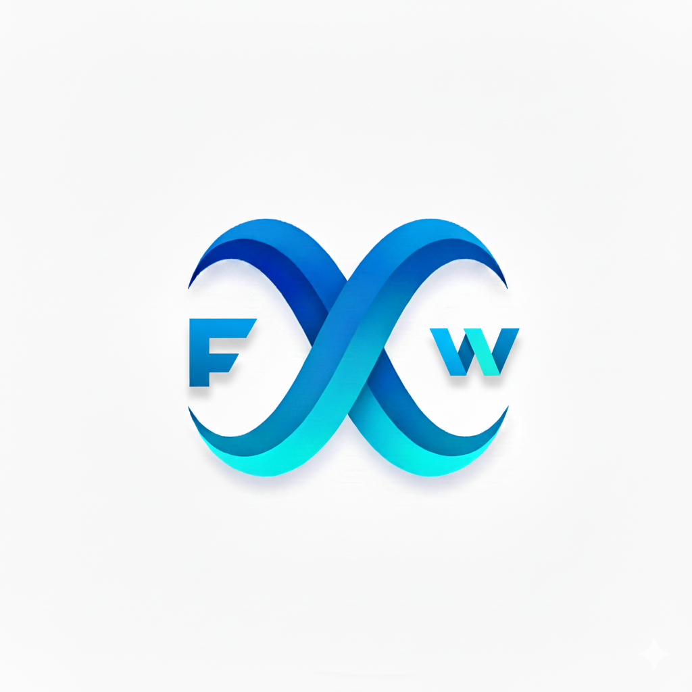
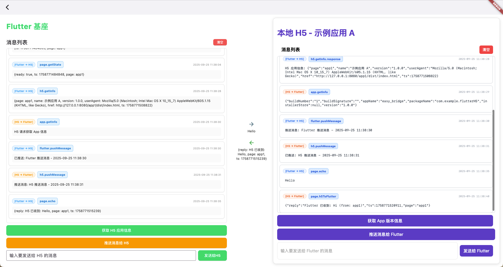

# Easy Bridge 

<div align="center">
  
</div>

<div align="center">
  <a href="README.md">🇨🇳 中文</a> | 
  <a href="README_EN.md">🇺🇸 English</a>
</div>

## 🖥️ Platform Support

| Platform | Status |
|----------|--------|
| Windows  | ✅ Supported |
| macOS    | ✅ Supported |
| Android  | ✅ Supported |

A hybrid development solution based on Flutter + WebView + local HTTP server, supporting bidirectional communication between Flutter host and H5 applications, with support for both local H5 apps and online URL loading.

## 📋 Project Overview

This framework provides a complete Flutter-H5 application interaction mechanism, including:

- 🔄 **Bidirectional Communication**: Flutter ↔ H5 method calls and event passing
- 🌐 **Multi-source Support**: Local H5 applications + online URL loading
- 🔌 **Bridge System**: Communication bridge based on AppBridge
- 🐛 **Debug Interface**: Real-time message display and interaction testing
- 🛡️ **Type Safety**: Complete error handling and timeout mechanisms
- 🔒 **Security Protection**: Redirect loop detection and error recovery

## 📱 Project Screenshots

<div align="center">
  
  <p><em>Main Application Interface - Bidirectional Communication Debug Interface between Flutter Host and H5 Apps</em></p>
</div>

## 🏗️ Project Structure

```
easy_bridge/
├── lib/
│   ├── main.dart                      # Application entry point
│   ├── app_center.dart                # Application center page
│   ├── h5_webview.dart                # Unified H5 WebView component
│   ├── app1_h5_webview_debug_page.dart # App1 debug page
│   └── utils/
│       ├── app_bridge.dart            # Core bridge
│       └── localhost_server_manager.dart # Local server manager
├── assets/h5/                         # H5 application resources
│   ├── app1/                          # Example application A
│   │   └── dist/                      # Build output directory
│   │       ├── index.html             # Main page
│   │       ├── app.js                 # JavaScript logic
│   │       └── style.css              # Stylesheet
│   └── app2/                          # Example application B
│       └── dist/
│           ├── index.html
│           ├── app.js
│           └── style.css
└── README.md                          # This documentation
```

## 🚀 Quick Start

### 1. Basic Usage

#### Local H5 Application

```dart
import 'package:flutter/material.dart';
import 'h5_webview.dart';
import 'utils/app_bridge.dart';

class MyApp extends StatelessWidget {
  @override
  Widget build(BuildContext context) {
    return MaterialApp(
      home: Scaffold(
        appBar: AppBar(title: Text('Local H5 App')),
        body: H5Webview(
          appName: 'app1',  // Corresponds to assets/h5/app1/dist/index.html
          bridge: AppBridge(),
          onLoadStop: (url) {
            print('Page loaded: $url');
          },
        ),
      ),
    );
  }
}
```

#### Online URL Loading

```dart
H5Webview(
  appName: 'online_demo',     // Used as identifier
  onlineUrl: 'https://flutter.dev',  // Online URL
  bridge: AppBridge(),
  onLoadStop: (url) {
    print('Online page loaded: $url');
  },
)
```

### 2. App Center Usage

After running the app, you will see the app center page with three examples:

- **Example App A (Local)**: Local H5 app with complete debug interface
- **Example App B (Local)**: Simple local H5 app
- **Online App Example**: Example for loading online URLs

### 3. Creating New H5 Applications

Create a new directory under `assets/h5/`, such as `myapp/`:

```
assets/h5/myapp/
└── dist/              # Build output directory
    ├── index.html     # Required: Main page (fixed entry file)
    ├── app.js         # Recommended: JavaScript logic
    └── style.css      # Optional: Stylesheet
```

## 🔧 Core Components

### H5Webview

Unified WebView component supporting both local H5 applications and online URL loading.

**Parameters:**

| Parameter | Type | Default | Description |
|-----------|------|---------|-------------|
| `appName` | `String` | Required | H5 app identifier. In local mode, corresponds to `assets/h5/<appName>/dist/`; in online mode, used as identifier |
| `onlineUrl` | `String?` | `null` | Online URL. If provided, local resources corresponding to `appName` will be ignored |
| `bridge` | `AppBridge` | Required | Bridge instance for Flutter-H5 communication |
| `onWebViewCreated` | `WebViewCreatedCallback?` | `null` | WebView creation callback |
| `onLoadStop` | `Function(String)?` | `null` | Page load completion callback |
| `onLoadError` | `Function(String, int, String)?` | `null` | Page load error callback |
| `onProgress` | `Function(int)?` | `null` | Loading progress callback |

### AppBridge

Core bridge responsible for communication between Flutter and H5.

**Features:**
- Bidirectional method calls (Request/Response)
- Bidirectional event passing (Fire-and-Forget)
- Automatic error handling and timeout mechanisms
- Type-safe parameter passing

### LocalhostServerManager

Local HTTP server manager that automatically handles port allocation and resource serving.

**Features:**
- Automatic port allocation and conflict handling
- Support for multiple static resource types
- Debug logging in development mode
- Singleton pattern to avoid duplicate startup

## 🐛 Debug Features

### App1H5WebviewDebugPage

Dedicated debug page providing complete bidirectional communication test interface:

**Interface Layout:**
- **Left: Flutter Host**
  - Unified message list (supports auto/manual scrolling)
  - Clear messages button
  - "Get H5 App Info" button
  - "Push Message to H5" button
  - Custom message input box

- **Center: Interaction Indicator**
  - Blue right arrow: Flutter → H5 messages
  - Green left arrow: H5 → Flutter messages
  - Real-time display of current message content

- **Right: H5 Application**
  - Complete H5 application interface
  - Real-time interaction with Flutter

**Debug Features:**
- Automatic message tracking and recording
- Error highlighting
- Timestamp and direction identification
- Smart scrolling (auto-scroll when near bottom)

## 📡 Communication Protocol

### 1. Method Calls (Request/Response)

#### Flutter → H5

**Flutter initiates calls:**

```dart
// Basic call
final result = await _bridge.invokeJs('h5.methodName', parameters);

// Example: Get H5 app info
final info = await _bridge.invokeJs('h5.getInfo');

// Example: Send message to H5
final reply = await _bridge.invokeJs('page.echo', {'message': 'Hello H5'});
```

**H5 registers methods:**

```javascript
// Register methods for Flutter to call
window.AppBridge.register('h5.getInfo', async function() {
  return {
    page: 'app1',
    name: document.title,
    version: '1.0.0',
    userAgent: navigator.userAgent,
    href: location.href,
    ts: Date.now()
  };
});

window.AppBridge.register('page.echo', async function(params) {
  const message = params.message;
  return {
    reply: 'H5 received: ' + message,
    page: 'app1',
    ts: Date.now()
  };
});
```

#### H5 → Flutter

**H5 initiates calls:**

```javascript
// Basic call
const result = await window.AppBridge.invoke('flutter.methodName', parameters);

// Example: Get Flutter app info
const appInfo = await window.AppBridge.invoke('app.getInfo');

// Example: Send message to Flutter
const reply = await window.AppBridge.invoke('page.h5ToFlutter', {
  message: 'Hello Flutter',
  from: 'app1'
});
```

**Flutter registers methods:**

```dart
// Register methods for H5 to call
_bridge.register('app.getInfo', (params) async {
  final info = await PackageInfo.fromPlatform();
  return {
    'appName': info.appName,
    'packageName': info.packageName,
    'version': info.version,
    'buildNumber': info.buildNumber,
    'buildSignature': info.buildSignature,
    'installerStore': info.installerStore,
  };
});

_bridge.register('page.h5ToFlutter', (params) async {
  String message;
  String? from;
  if (params is Map) {
    message = params['message']?.toString() ?? 'No message';
    from = params['from']?.toString();
  } else {
    message = params?.toString() ?? 'null';
  }
  
  final fullMessage = from != null ? '$message (from: $from)' : message;
  return {
    'reply': 'Flutter received: $fullMessage',
    'page': 'app1',
    'ts': DateTime.now().millisecondsSinceEpoch,
  };
});
```

### 2. Event System (Fire-and-Forget)

#### Flutter → H5

**Flutter sends events:**

```dart
// Send event to H5 (no need to wait for return)
await _bridge.emitEventToJs('flutter.pushMessage', {
  'message': 'Flutter push message',
  'from': 'flutter',
  'timestamp': DateTime.now().millisecondsSinceEpoch,
});
```

**H5 listens to events:**

```javascript
// Listen to events from Flutter
window.AppBridge.on('flutter.pushMessage', function(payload) {
  console.log('Received Flutter push:', payload.message);
  // Update UI to display push message
  document.getElementById('flutter-messages').innerHTML += 
    `<div>Flutter: ${payload.message}</div>`;
});
```

#### H5 → Flutter

**H5 sends events:**

```javascript
// Send event to Flutter (no need to wait for return)
window.AppBridge.emit('page.ready', { 
  ts: Date.now(), 
  page: 'app1' 
});

window.AppBridge.emit('h5.pushMessage', {
  message: 'H5 push message',
  from: 'h5',
  timestamp: Date.now()
});
```

**Flutter listens to events:**

```dart
// Listen to events from H5
_bridge.onEvent('page.ready', (payload) {
  print('H5 page ready: $payload');
});

_bridge.onEvent('h5.pushMessage', (payload) {
  final message = payload is Map && payload['message'] != null
      ? payload['message'].toString()
      : payload.toString();
  print('Received H5 push message: $message');
});
```

## 📚 Standard API Reference

### Flutter-provided Methods

| Method | Parameters | Return Value | Description |
|--------|------------|--------------|-------------|
| `page.h5ToFlutter` | `{message: string, from?: string}` | `{reply: string, page: string, ts: number}` | Receive H5 message and reply |
| `app.getInfo` | - | `{appName, packageName, version, buildNumber, buildSignature, installerStore}` | Get Flutter app info |

### H5-provided Methods

| Method | Parameters | Return Value | Description |
|--------|------------|--------------|-------------|
| `page.getState` | - | `{ready: boolean, ts: number, page: string}` | Get page state |
| `page.echo` | `{message: string}` | `{reply: string, page: string, ts: number}` | Echo test |
| `h5.getInfo` | - | `{page, name, version, userAgent, href, ts}` | Get H5 app info |

### Standard Events

#### Flutter → H5 Events

| Event | Data Format | Description |
|-------|-------------|-------------|
| `flutter.pushMessage` | `{message: string, from: string, timestamp: number}` | Flutter push message |

#### H5 → Flutter Events

| Event | Data Format | Description |
|-------|-------------|-------------|
| `page.ready` | `{ts: number, page: string}` | Page loaded |
| `h5.pushMessage` | `{message: string, from?: string, timestamp?: number}` | H5 push message |

## 🔒 Security & Error Handling

### Redirect Loop Protection

For potential redirect issues with online URLs, the framework provides multi-layer protection:

```dart
// Redirect count detection
if (_lastUrl == url?.toString()) {
  _redirectCount++;
  if (_redirectCount > 5) {
    print('[H5Webview] Redirect loop detected, stopping load');
    _controller?.stopLoading();
    return;
  }
}

// HTTP/HTTPS loop detection
shouldOverrideUrlLoading: (controller, navigationAction) async {
  // Prevent HTTP to HTTPS loop redirects
  if (loopCondition) {
    return NavigationActionPolicy.CANCEL;
  }
  return NavigationActionPolicy.ALLOW;
}
```

### Timeout Mechanism

All method calls have a default timeout (10 seconds), throwing `TimeoutException` after timeout:

```dart
try {
  final result = await _bridge.invokeJs('some.method');
} on TimeoutException {
  print('Call timeout');
} catch (e) {
  print('Call failed: $e');
}
```

### Error Propagation

- JavaScript errors propagate to Flutter
- Flutter errors propagate to H5
- Error messages are highlighted in debug interface
- All errors include detailed error info and stack traces

## 🔧 Development Guide

### Adding New App Pages

**1. Add new item in app center:**

```dart
// lib/app_center.dart
AppItem(
  title: 'New App',
  icon: Icons.new_app,
  builder: (context) => Scaffold(
    backgroundColor: Colors.white,
    appBar: AppBar(backgroundColor: Colors.white),
    body: H5Webview(
      key: UniqueKey(),
      appName: 'newapp',
      bridge: AppBridge(),
      // Optional: add online URL
      // onlineUrl: 'https://example.com',
    ),
  ),
)
```

### Creating Debug-enabled Pages

Reference `App1H5WebviewDebugPage` to create new debug pages:

```dart
class MyAppDebugPage extends StatefulWidget {
  final String appName;
  
  const MyAppDebugPage({Key? key, required this.appName}) : super(key: key);
  
  @override
  _MyAppDebugPageState createState() => _MyAppDebugPageState();
}

class _MyAppDebugPageState extends State<MyAppDebugPage> {
  final AppBridge _bridge = AppBridge();
  final List<MessageItem> _messageLog = [];
  
  @override
  void initState() {
    super.initState();
    _setupBridgeMethods();
    _setupBridgeEvents();
  }
  
  // Setup methods and event listeners...
}
```

### Creating New H5 Applications

**1. Create directory structure:**

```
assets/h5/myapp/
└── dist/
    ├── index.html
    ├── app.js
    └── style.css
```

**2. Basic HTML template:**

```html
<!doctype html>
<html lang="en">
  <head>
    <meta charset="utf-8" />
    <meta name="viewport" content="width=device-width, initial-scale=1" />
    <title>My App</title>
    <link rel="stylesheet" href="style.css" />
  </head>
  <body>
    <main>
      <h1>My H5 App</h1>
      <div id="flutter-messages"></div>
      <button onclick="sendToFlutter()">Send Message to Flutter</button>
    </main>
    <script src="app.js"></script>
  </body>
</html>
```

**3. Basic JavaScript template:**

```javascript
document.addEventListener('DOMContentLoaded', function () {
  // Wait for AppBridge ready
  if (window.AppBridge) {
    // Register methods
    window.AppBridge.register('h5.getInfo', async function() {
      return {
        page: 'myapp',
        name: document.title,
        version: '1.0.0',
        userAgent: navigator.userAgent,
        href: location.href,
        ts: Date.now()
      };
    });
    
    // Listen to Flutter events
    window.AppBridge.on('flutter.pushMessage', function(payload) {
      document.getElementById('flutter-messages').innerHTML += 
        `<div>Flutter: ${payload.message}</div>`;
    });
    
    // Send ready event
    window.AppBridge.emit('page.ready', { 
      ts: Date.now(), 
      page: 'myapp' 
    });
  }
});

function sendToFlutter() {
  if (window.AppBridge) {
    window.AppBridge.invoke('page.h5ToFlutter', {
      message: 'Message from MyApp',
      from: 'myapp'
    }).then(result => {
      console.log('Flutter reply:', result);
    });
  }
}
```

## 📲 Application Integration Guide

Easy Bridge supports three integration methods. The system automatically aggregates applications from all sources and displays them in the application center.

### Integration Methods Overview

| Integration Method | Use Case | Advantages | Disadvantages |
|-------------------|----------|------------|---------------|
| **Local Apps** | Built-in apps, example apps | Ships with app, fast loading | Requires new release to update |
| **Cached Apps** | Dynamically downloaded apps | Supports hot updates, flexible deployment | Requires initial download |
| **Online Apps** | Third-party websites, external services | Real-time updates, no packaging needed | Network dependent, slower loading |

### Method 1: Local App Integration

#### Directory Structure

```
assets/h5/your-app/
├── manifest.json          # App configuration (required)
├── icon.png              # App icon 512x512 (required)
└── dist/
    └── index.html        # Entry file (required)
```

#### manifest.json Configuration

```json
{
  "appId": "your-unique-app-id",
  "name": "Your App Name",
  "version": "1.0.0",
  "description": "App description",
  "icon": "icon.png"
}
```

**Field Descriptions:**

| Field | Type | Required | Description |
|-------|------|----------|-------------|
| `appId` | String | ✅ | Unique app identifier, UUID recommended |
| `name` | String | ✅ | App display name |
| `version` | String | ✅ | App version number |
| `description` | String | ✅ | App description |
| `icon` | String | ✅ | App icon filename (relative path) |

#### Register App

Modify the `_handleGetLocalApps` method in `lib/app_center.dart`:

```dart
_handleGetLocalApps([
  'debugger-app',
  'vue-app',
  'your-app',  // Add your app name
])
```

#### Configure Assets

Add to `pubspec.yaml`:

```yaml
flutter:
  assets:
    - assets/h5/your-app/dist/
    - assets/h5/your-app/icon.png
    - assets/h5/your-app/manifest.json
```

### Method 2: Cached App Integration

#### App Storage Location

The system automatically scans the `{ApplicationSupportDirectory}/h5/` directory:

```
{ApplicationSupportDirectory}/h5/your-app/
├── manifest.json          # App configuration (required)
├── icon.png              # App icon 512x512 (required)
└── dist/
    └── index.html        # Entry file (required)
```

The manifest.json format is identical to local apps and must include the five required fields: `appId`, `name`, `version`, `description`, and `icon`.

**Get Path:**

```dart
import 'package:path_provider/path_provider.dart';

final appSupportDir = await getApplicationSupportDirectory();
// macOS: ~/Library/Application Support/com.example.easyBridge/
```

#### Download App Example

Simply copy the app files to the corresponding directory, and the system will automatically load them.

### Method 3: Online App Integration

#### Configuration Format

Online app configuration is stored in `SharedPreferences` with the key `online_apps_config`:

```json
[
  {
    "id": "your-website",
    "name": "Your Website",
    "version": "1.0.0",
    "description": "Website description",
    "iconUrl": "https://your-site.com/icon.png",
    "url": "https://your-site.com"
  }
]
```

**Field Descriptions:**

| Field | Type | Required | Description |
|-------|------|----------|-------------|
| `id` | String | ✅ | Unique app identifier |
| `name` | String | ✅ | App display name |
| `version` | String | ✅ | App version number |
| `description` | String | ✅ | App description |
| `iconUrl` | String | ✅ | App icon URL |
| `url` | String | ✅ | App access URL |

#### Add Online App

```dart
import 'package:shared_preferences/shared_preferences.dart';
import 'dart:convert';

final prefs = await SharedPreferences.getInstance();
String? jsonString = prefs.getString('online_apps_config');
List<dynamic> apps = jsonString != null ? json.decode(jsonString) : [];

apps.add({
  'id': 'my-website',           // Required: unique identifier
  'name': 'My Website',          // Required: app name
  'version': '1.0.0',            // Required: version number
  'description': 'Website description',  // Required: app description
  'iconUrl': 'https://mywebsite.com/icon.png',  // Required: icon URL
  'url': 'https://mywebsite.com',  // Required: access URL
});

await prefs.setString('online_apps_config', json.encode(apps));
```

### App Loading Priority

The system loads all three types of apps in parallel. Display order: **Cached Apps** → **Local Apps** → **Online Apps**

## 🔧 Platform Configuration

### macOS Configuration

Running this app on macOS requires configuring network permissions and sandbox settings to support local HTTP server and WebView loading.

#### 1. Network Transport Security Configuration

Add the following configuration to `macos/Runner/Info.plist`:

```xml
<key>NSAppTransportSecurity</key>
<dict>
  <key>NSAllowsArbitraryLoadsInWebContent</key>
  <true/>
  <key>NSAllowsLocalNetworking</key>
  <true/>
  <key>NSExceptionDomains</key>
  <dict>
    <key>localhost</key>
    <dict>
      <key>NSIncludesSubdomains</key>
      <true/>
      <key>NSTemporaryExceptionAllowsInsecureHTTPLoads</key>
      <true/>
    </dict>
    <key>127.0.0.1</key>
    <dict>
      <key>NSIncludesSubdomains</key>
      <true/>
      <key>NSTemporaryExceptionAllowsInsecureHTTPLoads</key>
      <true/>
    </dict>
  </dict>
</dict>
```

#### 2. Sandbox Permissions Configuration

Add to `macos/Runner/DebugProfile.entitlements` and `macos/Runner/Release.entitlements`:

```xml
<key>com.apple.security.app-sandbox</key>
<true/>
<key>com.apple.security.network.server</key>
<true/>
<key>com.apple.security.network.client</key>
<true/>
```

## 📦 Dependencies

Ensure the necessary dependencies are added to `pubspec.yaml`:

```yaml
dependencies:
  flutter:
    sdk: flutter
  flutter_inappwebview: ^6.0.0
  package_info_plus: ^4.0.0

flutter:
  assets:
    - assets/h5/app1/dist/
    - assets/h5/app2/dist/
    # When adding new apps, add corresponding resource paths here
```

## 🐛 Common Issues

### Q: H5 page fails to load?
A: Check if the `assets/h5/<appName>/dist/index.html` directory structure and files exist, ensure `flutter_inappwebview` dependency is correctly installed.

### Q: Online URL infinite redirect?
A: The framework has built-in redirect loop detection that automatically stops loop redirects. Check console logs for detailed information.

### Q: AppBridge undefined?
A: Ensure JavaScript code in HTML executes in the `DOMContentLoaded` event and check if AppBridge is injected.

### Q: Method call timeout?
A: Check if method names are correctly registered, parameter formats match, and H5 async methods return correctly.

### Q: Debug interface messages not showing?
A: Ensure using `App1H5WebviewDebugPage` or similar debug pages; regular `H5Webview` doesn't include debug interface.

## 📄 License

This project is licensed under the MIT License. See LICENSE file for details.

## 🤝 Contributing

Issues and Pull Requests are welcome to help improve this project!

---

**🎯 Quick Start Recommendations:**
1. Run the app and experience the three examples in the app center
2. Focus on experiencing the complete debug features of "Example App A (Local)"
3. View code implementation in `assets/h5/app1/dist/`
4. Reference API list to add your own methods and events
5. Create new H5 applications for practice

## TODO List
1. More online URL compatibility optimizations
2. Performance monitoring and analysis tools
3. H5 application hot reload support 