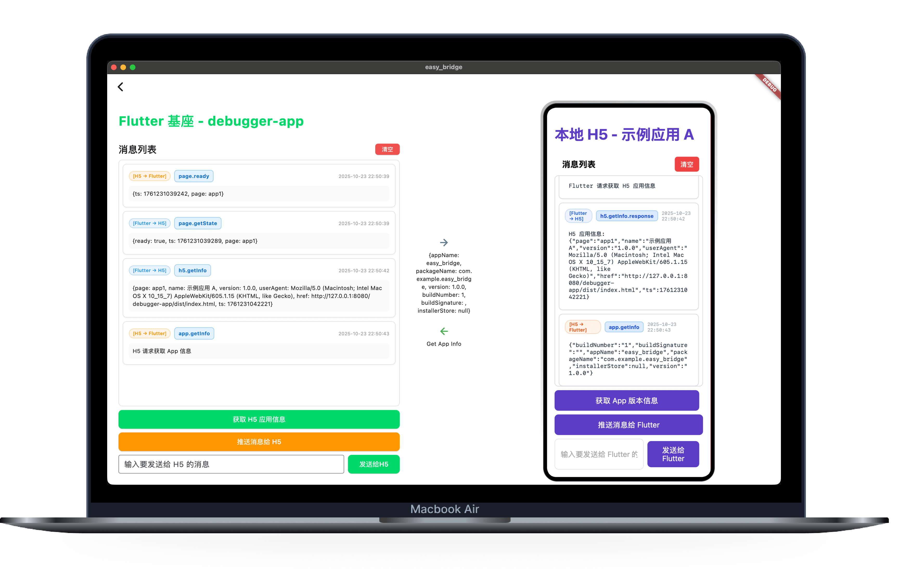

# Easy Bridge 

<div align="center">
  
</div>

<div align="center">
  <a href="README.md">🇨🇳 中文</a> | 
  <a href="README_EN.md">🇺🇸 English</a>
</div>

## 🖥️ Platform Support

| Platform | Status |
|----------|--------|
| Windows  | ✅ Supported |
| macOS    | ✅ Supported |
| Android  | ✅ Supported |

A hybrid development solution based on Flutter + WebView + local HTTP server, supporting bidirectional communication between Flutter host and H5 applications, with support for both local H5 apps and online URL loading.

## 📋 Project Overview

This framework provides a complete Flutter-H5 application interaction mechanism, including:

- 🔄 **Bidirectional Communication**: Flutter ↔ H5 method calls and event passing
- 🌐 **Multi-source Support**: Local H5 applications + online URL loading
- 🔌 **Bridge System**: Communication bridge based on AppBridge
- 🐛 **Debug Interface**: Real-time message display and interaction testing
- 🛡️ **Type Safety**: Complete error handling and timeout mechanisms
- 🔒 **Security Protection**: Redirect loop detection and error recovery

## 📱 Project Screenshots

<div align="center">
  
  <p><em>Main Application Interface - Bidirectional Communication Debug Interface between Flutter Host and H5 Apps</em></p>
</div>

<div align="center">
  
  <p><em>App Demo - Real-time Bidirectional Communication between Flutter and H5</em></p>
</div>

## 🏗️ Project Structure

```
easy_bridge/
├── lib/
│   ├── main.dart                      # Application entry point
│   ├── app_center.dart                # Application center page
│   ├── h5_webview.dart                # Unified H5 WebView component
│   ├── app1_h5_webview_debug_page.dart # App1 debug page
│   └── utils/
│       ├── app_bridge.dart            # Core bridge
│       └── localhost_server_manager.dart # Local server manager
├── assets/h5/                         # H5 application resources
│   ├── app1/                          # Example application A
│   │   └── dist/                      # Build output directory
│   │       ├── index.html             # Main page
│   │       ├── app.js                 # JavaScript logic
│   │       └── style.css              # Stylesheet
│   └── app2/                          # Example application B
│       └── dist/
│           ├── index.html
│           ├── app.js
│           └── style.css
└── README.md                          # This documentation
```

## 🚀 Quick Start

### 1. Basic Usage

#### Local H5 Application

```dart
import 'package:flutter/material.dart';
import 'h5_webview.dart';
import 'utils/app_bridge.dart';

class MyApp extends StatelessWidget {
  @override
  Widget build(BuildContext context) {
    return MaterialApp(
      home: Scaffold(
        appBar: AppBar(title: Text('Local H5 App')),
        body: H5Webview(
          appName: 'app1',  // Corresponds to assets/h5/app1/dist/index.html
          bridge: AppBridge.instance,
          onLoadStop: (url) {
            print('Page loaded: $url');
          },
        ),
      ),
    );
  }
}
```

#### Loading from Online URL

```dart
H5Webview(
  appName: 'online_demo',     // Used as identifier
  onlineUrl: 'https://flutter.dev',  // Online URL
  bridge: AppBridge.instance,
  onLoadStop: (url) {
    print('Online page loaded: $url');
  },
)
```

### 2. App Center Usage

After running the app, you will see the app center page with three examples:

- **Example App A (Local)**: Local H5 app with complete debug interface
- **Example App B (Local)**: Simple local H5 app
- **Online App Example**: Example for loading online URLs

### 3. Creating New H5 Applications

Create a new directory under `assets/h5/`, such as `myapp/`:

```
assets/h5/myapp/
└── dist/              # Build output directory
    ├── index.html     # Required: Main page (fixed entry file)
    ├── app.js         # Recommended: JavaScript logic
    └── style.css      # Optional: Stylesheet
```

## 🔧 Core Components

### H5Webview

Unified WebView component supporting both local H5 applications and online URL loading.

**Parameters:**

| Parameter | Type | Default | Description |
|-----------|------|---------|-------------|
| `appName` | `String` | Required | H5 app identifier. In local mode, corresponds to `assets/h5/<appName>/dist/`; in online mode, used as identifier |
| `onlineUrl` | `String?` | `null` | Online URL. If provided, local resources corresponding to `appName` will be ignored |
| `bridge` | `AppBridge` | Required | Bridge instance for Flutter-H5 communication |
| `onWebViewCreated` | `WebViewCreatedCallback?` | `null` | WebView creation callback |
| `onLoadStop` | `Function(String)?` | `null` | Page load completion callback |
| `onLoadError` | `Function(String, int, String)?` | `null` | Page load error callback |
| `onProgress` | `Function(int)?` | `null` | Loading progress callback |

### AppBridge

Core bridge responsible for communication between Flutter and H5.

**Features:**
- Bidirectional method calls (Request/Response)
- Bidirectional event passing (Fire-and-Forget)
- Automatic error handling and timeout mechanisms
- Type-safe parameter passing

### LocalhostServerManager

Local HTTP server manager that automatically handles port allocation and resource serving.

**Features:**
- Automatic port allocation and conflict handling
- Support for multiple static resource types
- Debug logging in development mode
- Singleton pattern to avoid duplicate startup

## 🐛 Debug Features

### App1H5WebviewDebugPage

Dedicated debug page providing complete bidirectional communication test interface:

**Interface Layout:**
- **Left: Flutter Host**
  - Unified message list (supports auto/manual scrolling)
  - Clear messages button
  - "Get H5 App Info" button
  - "Push Message to H5" button
  - Custom message input box

- **Center: Interaction Indicator**
  - Blue right arrow: Flutter → H5 messages
  - Green left arrow: H5 → Flutter messages
  - Real-time display of current message content

- **Right: H5 Application**
  - Complete H5 application interface
  - Real-time interaction with Flutter

**Debug Features:**
- Automatic message tracking and recording
- Error highlighting
- Timestamp and direction identification
- Smart scrolling (auto-scroll when near bottom)

## 📡 Communication Protocol

### 1. Method Calls (Request/Response)

#### Flutter → H5

**Flutter initiates calls:**

```dart
// Basic call
final result = await _bridge.invokeJs('h5.methodName', parameters);

// Example: Get H5 app info
final info = await _bridge.invokeJs('h5.getInfo');

// Example: Send message to H5
final reply = await _bridge.invokeJs('page.echo', {'message': 'Hello H5'});
```

**H5 registers methods:**

```javascript
// Register methods for Flutter to call
window.AppBridge.register('h5.getInfo', async function() {
  return {
    page: 'app1',
    name: document.title,
    version: '1.0.0',
    userAgent: navigator.userAgent,
    href: location.href,
    ts: Date.now()
  };
});

window.AppBridge.register('page.echo', async function(params) {
  const message = params.message;
  return {
    reply: 'H5 received: ' + message,
    page: 'app1',
    ts: Date.now()
  };
});
```

#### H5 → Flutter

**H5 initiates calls:**

```javascript
// Basic call
const result = await window.AppBridge.invoke('flutter.methodName', parameters);

// Example: Get Flutter app info
const appInfo = await window.AppBridge.invoke('app.getInfo');

// Example: Send message to Flutter
const reply = await window.AppBridge.invoke('page.h5ToFlutter', {
  message: 'Hello Flutter',
  from: 'app1'
});
```

**Flutter registers methods:**

```dart
// Register methods for H5 to call
_bridge.register('app.getInfo', (params) async {
  final info = await PackageInfo.fromPlatform();
  return {
    'appName': info.appName,
    'packageName': info.packageName,
    'version': info.version,
    'buildNumber': info.buildNumber,
    'buildSignature': info.buildSignature,
    'installerStore': info.installerStore,
  };
});

_bridge.register('page.h5ToFlutter', (params) async {
  String message;
  String? from;
  if (params is Map) {
    message = params['message']?.toString() ?? 'No message';
    from = params['from']?.toString();
  } else {
    message = params?.toString() ?? 'null';
  }
  
  final fullMessage = from != null ? '$message (from: $from)' : message;
  return {
    'reply': 'Flutter received: $fullMessage',
    'page': 'app1',
    'ts': DateTime.now().millisecondsSinceEpoch,
  };
});
```

### 2. Event System (Fire-and-Forget)

#### Flutter → H5

**Flutter sends events:**

```dart
// Send event to H5 (no need to wait for return)
await _bridge.emitEventToJs('flutter.pushMessage', {
  'message': 'Flutter push message',
  'from': 'flutter',
  'timestamp': DateTime.now().millisecondsSinceEpoch,
});
```

**H5 listens to events:**

```javascript
// Listen to events from Flutter
window.AppBridge.on('flutter.pushMessage', function(payload) {
  console.log('Received Flutter push:', payload.message);
  // Update UI to display push message
  document.getElementById('flutter-messages').innerHTML += 
    `<div>Flutter: ${payload.message}</div>`;
});
```

#### H5 → Flutter

**H5 sends events:**

```javascript
// Send event to Flutter (no need to wait for return)
window.AppBridge.emit('page.ready', { 
  ts: Date.now(), 
  page: 'app1' 
});

window.AppBridge.emit('h5.pushMessage', {
  message: 'H5 push message',
  from: 'h5',
  timestamp: Date.now()
});
```

**Flutter listens to events:**

```dart
// Listen to events from H5
_bridge.onEvent('page.ready', (payload) {
  print('H5 page ready: $payload');
});

_bridge.onEvent('h5.pushMessage', (payload) {
  final message = payload is Map && payload['message'] != null
      ? payload['message'].toString()
      : payload.toString();
  print('Received H5 push message: $message');
});
```

## 📚 Standard API Reference

### Flutter-provided Methods

| Method | Parameters | Return Value | Description |
|--------|------------|--------------|-------------|
| `page.h5ToFlutter` | `{message: string, from?: string}` | `{reply: string, page: string, ts: number}` | Receive H5 message and reply |
| `app.getInfo` | - | `{appName, packageName, version, buildNumber, buildSignature, installerStore}` | Get Flutter app info |

### H5-provided Methods

| Method | Parameters | Return Value | Description |
|--------|------------|--------------|-------------|
| `page.getState` | - | `{ready: boolean, ts: number, page: string}` | Get page state |
| `page.echo` | `{message: string}` | `{reply: string, page: string, ts: number}` | Echo test |
| `h5.getInfo` | - | `{page, name, version, userAgent, href, ts}` | Get H5 app info |

### Standard Events

#### Flutter → H5 Events

| Event | Data Format | Description |
|-------|-------------|-------------|
| `flutter.pushMessage` | `{message: string, from: string, timestamp: number}` | Flutter push message |

#### H5 → Flutter Events

| Event | Data Format | Description |
|-------|-------------|-------------|
| `page.ready` | `{ts: number, page: string}` | Page loaded |
| `h5.pushMessage` | `{message: string, from?: string, timestamp?: number}` | H5 push message |

## 🔒 Security & Error Handling

### Redirect Loop Protection

For potential redirect issues with online URLs, the framework provides multi-layer protection:

```dart
// Redirect count detection
if (_lastUrl == url?.toString()) {
  _redirectCount++;
  if (_redirectCount > 5) {
    print('[H5Webview] Redirect loop detected, stopping load');
    _controller?.stopLoading();
    return;
  }
}

// HTTP/HTTPS loop detection
shouldOverrideUrlLoading: (controller, navigationAction) async {
  // Prevent HTTP to HTTPS loop redirects
  if (loopCondition) {
    return NavigationActionPolicy.CANCEL;
  }
  return NavigationActionPolicy.ALLOW;
}
```

### Timeout Mechanism

All method calls have a default timeout (10 seconds), throwing `TimeoutException`